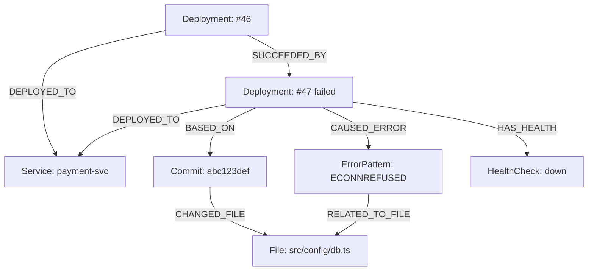

# Fortis-CI Technical Overview

This document provides a deep technical evaluation of the Fortis-CI platform based on the current architecture and project requirements.

## 1. Product Overview

**What problem does Fortis-CI solve?**
Deployment failures are inherently graph problems, not table problems. Traditional CI/CD tools and APMs spread logs, metrics, and deployment state across disparate systems. Answering "what caused this production failure?" often requires manually joining data across GitHub, hosting providers, and monitoring tools. Fortis-CI solves this by modeling the entire deployment lifecycle—services, commits, files, errors, and health—as a single connected graph in Neo4j.

**Primary Use Cases:**
*   **Rapid Root Cause Analysis (RCA):** Automatically correlating runtime errors in logs to specific files modified in a deployment commit via graph traversal.
*   **Automated Recovery:** Safely triggering rollbacks to the last known healthy deployment when health checks fail, using a guaranteed safe traversal path.
*   **Deployment Risk Scoring:** Assessing the risk of a pipeline push based on heuristics and historical file-level failure rates.
*   **Blast Radius Analysis:** Determining upstream and downstream service impacts when a microservice degrades.

**Implemented vs. Planned Features:**
*   **V1 (In Development):** Webhook ingestion, deployment graph creation, manual redeploys, basic health monitoring, and the dashboard.
*   **V2 (Planned):** Automated RCA (LogFetchJob), automated rollback engine, diff engine.
*   **V3 (Planned):** Pre-deployment risk scoring, environment drift detection, rollback preview.
*   **V4 (Planned):** Enterprise scalability, RBAC, SSO, Helm charts.

---

## 2. Architecture

Fortis-CI operates as a **single centralized control plane** per environment, rather than a sidecar per microservice. This is critical: a single graph is required to map cross-service dependencies (`DEPENDS_ON`).

```text
GitHub Actions (webhook)
       ↓
Backend API (Node.js + Express + TypeScript)
  ├── Webhook Processor (idempotent — workflow_run_id UNIQUE)
  ├── Async LogFetchJob (GitHub Actions zip → parse → ErrorPattern)
  ├── RCA Engine (rule-based, 8 error pattern types)
  ├── Rollback Engine (Tier 1: health-only | Tier 2: error-correlated)
  ├── Health Worker (60s polling → HealthCheck nodes)
  ├── Notification Service (GitHub PR + Slack + Email)
  └── Git Diff Engine (CHANGED_FILE + RELATED_TO_FILE relationships)
       ↓
Neo4j (Graph) + Redis (Cache)
       ↓
Next.js Dashboard
```

**Components:**
*   **Backend Services:** Node.js (v18 LTS), Express, TypeScript (v5).
*   **Databases:** Neo4j 5.x Community (Primary Data Store), Redis 7 (Time-series cache, rate-limiting, session store).
*   **Queues / Workers:** Currently uses in-memory `p-limit` concurrency limiters for health polling and log fetching. Distributed queues (BullMQ) are deferred to V4.
*   **APIs:** REST API consumed by the frontend via polling. Server-Sent Events (SSE) are deferred.
*   **Dashboard:** Next.js 14 App Router with React Server Components, using `react-force-graph` for visualization.

---

## 3. Deployment Flow

**From Git Push to Deployment:**
1.  A developer pushes code, triggering a GitHub Actions workflow.
2.  Upon completion (or state change), GitHub sends a `workflow_run` webhook to Fortis-CI at the Organization or Repository level.
3.  Fortis-CI's Webhook Processor verifies the `X-Hub-Signature-256` signature.
4.  It checks the `workflow_run_id` against Neo4j to guarantee idempotency.
5.  It attempts to match the payload's `repository.full_name` against registered `Service` nodes. For monorepos, it applies a `path_filter` (glob) against the changed files fetched from GitHub.
6.  If matched, it creates a `Deployment` node, links it to a `Commit` node, and associates it with the `Service`.
7.  An asynchronous `LogFetchJob` is spawned to analyze workflow logs for RCA.
8.  The 60s `Health Worker` begins polling the service to verify operational state.

**Rollbacks:**
If the Health Worker detects failure thresholds, the Rollback Engine executes a Cypher query to locate the last stable deployment and invokes the GitHub Actions re-run API.

---

## 4. Graph Model

Fortis-CI relies heavily on its graph schema.

**Node Types:**
`Service`, `Deployment`, `Commit`, `File`, `ErrorPattern`, `HealthCheck`, `EnvSnapshot`, `RollbackEvent`.

**Relationship Types:**
`DEPLOYED_TO`, `BASED_ON`, `CHANGED_FILE`, `CAUSED_ERROR`, `RELATED_TO_FILE`, `HAS_HEALTH`, `SUCCEEDED_BY`, `ROLLED_BACK_TO`, `TRIGGERED`, `REPLACED_BY`, `BELONGS_TO`, `SNAPSHOT_FOR`, `DEPENDS_ON`.

**Example Graph for a Deployment Failure:**



---

## 5. Root Cause Analysis

**Algorithm & Execution:**
RCA is not calculated at webhook ingestion. It relies on an async `LogFetchJob` that triggers post-deployment.
1.  Calls GitHub API for workflow logs.
2.  Follows 302 redirect to download a zipped log archive into memory.
3.  Unzips and processes line-by-line using strict memory guardrails (skips files > 5MB, processes max 10,000 lines, aborts if > 60 seconds).
4.  Evaluates lines against predefined regex patterns.
5.  Populates `ErrorPattern` nodes and `CAUSED_ERROR` edges.

**Traversal Logic:**
A single Cypher query traverses: `Deployment` → `CAUSED_ERROR` → `ErrorPattern` → `RELATED_TO_FILE` → `File` ← `CHANGED_FILE` ← `Commit`. If an error maps directly to a file modified in the deployment's commit, confidence is marked as High.

**Failure Scenarios Detected:**
DB Connection (`ECONNREFUSED`), API Timeout (`ETIMEDOUT`), Missing Env Var, Port Conflict (`EADDRINUSE`), OOM (`JavaScript heap out of memory`), Auth Failure, DNS Failure, Slow Query.

---

## 6. Health Monitoring

*   **Polling Interval:** A background cron worker executes every 60 seconds using a synchronous `p-limit` concurrency cap of 20 to prevent network flooding.
*   **State Transitions:**
    *   `Healthy`: HTTP 200, response time < 500ms.
    *   `Degraded`: HTTP 200, response time 500ms - 2s.
    *   `Down`: Non-200, timeout (>10s), or network error.
*   **Failure Detection Logic:** Rollbacks are triggered upon observing **3 consecutive `Down`** states (~2 min latency) or persisting in a **`Degraded`** state for > 5 minutes.

---

## 7. Rollback System

**Decision Engine:**
Rollback targets are selected via graph traversal using the `SUCCEEDED_BY` timeline chain.
> **Critical Safety Mechanism:** The traversal strictly ignores the `REPLACED_BY` edge (which is write-only for auditing). Traversing `REPLACED_BY` would result in infinite rollback loops by considering already-failed/rolled-back deployments as valid candidates.

**Safety Mechanisms:**
*   **Cooldown:** A 15-minute global cooldown per service after an auto-rollback to prevent flapping.
*   **Max Depth:** Rollback depth is strictly 1. Rollbacks of rollbacks are prohibited automatically.
*   **Manual Override:** Available directly from the Next.js dashboard at all times, bypassing the cooldown.
*   **Intervention:** If no prior clean deployment exists in the `SUCCEEDED_BY` chain, the system alerts all channels for manual intervention instead of guessing.

---

## 8. Infrastructure Requirements

*   **Minimum Topology:** A single Docker Compose stack hosted inside the customer's VPC.
*   **Resource Requirements:**
    *   Neo4j 5.x: 512MB initial heap, 1GB max heap.
    *   Redis 7: 256MB max memory limit (allkeys-lru eviction).
    *   Node.js Backend & Next.js Frontend: Minimal footprint.
*   **Deployment Support:**
    *   Docker: `docker-compose.yml` is the primary, officially supported deployment method for V1.
    *   Terraform: Native AWS modules exist (`terraform-aws-fortis-ci`).
    *   Kubernetes: Helm charts are currently not provided but are slated for V4 hardening.

---

## 9. Security

*   **Authentication:** NextAuth.js (GitHub OAuth) handles dashboard access. Internal backend endpoints use JWT.
*   **Authorization:** RBAC and SSO are Enterprise-only features gated behind `SENTINEL_LICENSE_KEY`.
*   **Secret Management:** "Environment Drift" detection queries the GitHub Secrets API. Crucially, the GitHub API **only returns secret key names**, not values. Fortis-CI creates `EnvSnapshot` nodes of these key names to detect config drift (e.g., a missing key). Secret values are never exposed or stored.
*   **Multi-Tenancy:** The platform is currently strictly single-tenant (Self-Hosted). A managed SaaS multi-tenant offering is relegated to "Phase 3."

---

## 10. Current Limitations

*   **Scalability Bottlenecks:** The 60s Health Worker uses `Promise.all` with a `p-limit`. Above ~50 microservices, this synchronous polling will overrun the 60s window. BullMQ is required but not yet implemented.
*   **API Rate Limiting:** The `LogFetchJob` heavily relies on the GitHub Actions API, which enforces a strict 5,000 requests/hour limit per token.
*   **Drift Accuracy:** Environment drift detection only checks key *presence*, not value mutation.
*   **Log Processing:** In-memory unzipping of large monorepo workflow logs is precarious and relies on strict circuit breakers (aborting at >60s or >5MB) to prevent container OOMs.
*   **UI Updates:** The dashboard uses REST polling rather than Server-Sent Events (SSE).

---

## 11. Production Readiness

**What is production-ready today?**
Nothing should be blindly trusted for automated production writes. The application is tagged as **"In Development" (V1 - See Everything)**.
You can safely deploy it to production for **Read-Only Observability**. It is stable enough to ingest webhooks, model the deployment graph, track API health, and allow manual redeployments via the dashboard.

**What should NOT be trusted in production yet?**
*   **Automated Rollbacks (V2 feature):** Do not enable auto-rollbacks yet. The rollback engine's safety mechanisms (cooldowns, depth limits) need extensive soak testing against live traffic.
*   **Automated RCA:** The `LogFetchJob` is prone to OOM edge cases and rate limits on large repositories.
*   **Scale:** Do not register more than 50 microservices on a single instance until the task queue architecture replaces `p-limit`.
